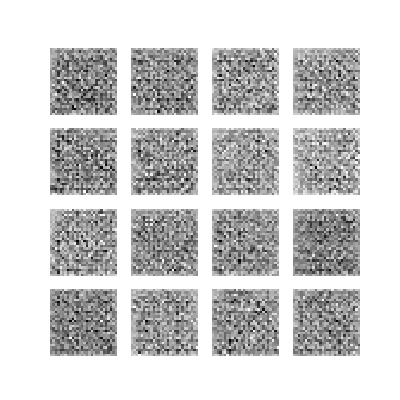
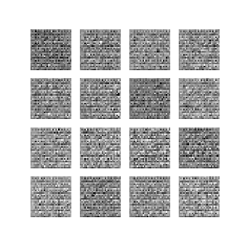

## CVAE Experiments

This repo contains an implementation of CVAE on Tensorflow with some simple experiments.

Model outputs after training for 100 epochs. The left figure depicts training without Batch Normalization while the right figure is training with Batch Normalization.

 
